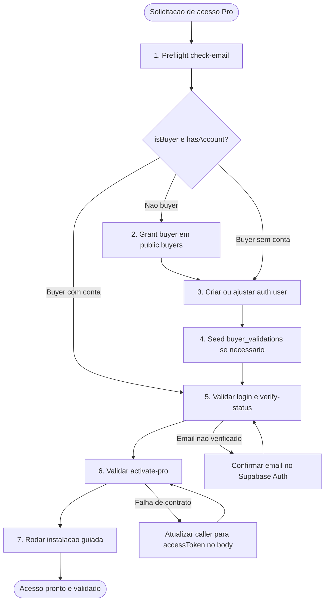

# Workflow: Pro Access Grant

**Versao:** 1.0
**Tipo:** Operations
**Autor:** Dex + validated with live AIOX Pro flow
**Data de Criacao:** 2026-04-20
**Tags:** pro, support, devops, supabase, vercel, installer

---

## Visao Geral

O workflow **Pro Access Grant** padroniza a concessao ou restauracao de acesso ao AIOX Pro para um usuario final, cobrindo:

- preflight de entitlement e conta
- concessao de buyer
- criacao ou ajuste da conta no Supabase Auth
- validacao direta da API
- validacao final pelo instalador guiado

### Objetivo

Permitir que `@devops` execute o suporte de acesso Pro sempre do mesmo jeito, com evidencias objetivas e sem rediscovering manual.

### Quando usar

- usuario pediu criacao de acesso Pro
- usuario pediu reset de senha do Pro
- usuario reportou que comprou mas `check-email` nao reconhece
- usuario ja tem conta mas a ativacao nao conclui

### Quando nao usar

- bug de produto fora do fluxo de licenciamento
- pedido de licenca key legada sem auth por email

---

## Fluxo Principal

---

## Steps Detalhados

### Step 1: Preflight

| Campo | Valor |
|-------|-------|
| **ID** | `preflight` |
| **Agente** | `@devops` |
| **Acao** | Executar `POST /api/v1/auth/check-email` |

#### Saida esperada

- `isBuyer=true|false`
- `hasAccount=true|false`

#### Decisao

- se `isBuyer=false`: ir para `grant-buyer`
- se `hasAccount=false`: ir para `create-account`
- se ambos `true`: ir para `api-verify`

### Step 2: Grant Buyer

| Campo | Valor |
|-------|-------|
| **ID** | `grant-buyer` |
| **Agente** | `@devops` |
| **Acao** | Upsert em `public.buyers` |

#### Regras

- email sempre em lowercase
- `is_active=true`
- `source='manual_support'`

### Step 3: Create Account

| Campo | Valor |
|-------|-------|
| **ID** | `create-account` |
| **Agente** | `@devops` |
| **Acao** | Criar ou ajustar usuario no Supabase Auth |

#### Regras

- definir a senha solicitada pelo suporte
- marcar email como confirmado
- nao criar usuario duplicado

### Step 4: Seed Local Fallback

| Campo | Valor |
|-------|-------|
| **ID** | `seed-local-fallback` |
| **Agente** | `@devops` |
| **Acao** | Upsert em `public.buyer_validations` |

#### Quando executar

- buyer RPC instavel
- grant muito recente ainda nao refletido no preflight

### Step 5: API Verify

| Campo | Valor |
|-------|-------|
| **ID** | `api-verify` |
| **Agente** | `@devops` |
| **Acao** | Validar `login` e `verify-status` |

#### Pass criteria

- `login` retorna `accessToken`
- `verify-status` retorna `emailVerified=true`

### Step 6: Activate Pro

| Campo | Valor |
|-------|-------|
| **ID** | `activate-pro` |
| **Agente** | `@devops` |
| **Acao** | Validar `POST /api/v1/auth/activate-pro` |

#### Pass criteria

- `201` com `licenseKey` no primeiro grant
- ou `200` com restauracao idempotente em reinstalacao

### Step 7: Guided Install Validation

| Campo | Valor |
|-------|-------|
| **ID** | `guided-install-validation` |
| **Agente** | `@devops` |
| **Acao** | Rodar instalador guiado como usuario |

#### Validacao obrigatoria

- path source checkout
- path tarball empacotado

#### Pass criteria

- Pro instalado
- verificacao final do installer em verde
- `.claude/skills`, `.claude/commands` e `.codex/skills` presentes

---

## Entradas

- `target_email`
- `target_password`
- `reset_password` (boolean)
- `run_guided_validation` (boolean, default: `true` quando houve mudanca de codigo)

---

## Saidas

- entitlement confirmado
- conta criada ou atualizada
- email confirmado
- Pro ativado ou restaurado
- evidencias de API e installer

---

## Preconditions

- acesso ao projeto Supabase `evvvnarpwcdybxdvcwjh`
- acesso ao projeto Vercel `aiox-license-server`
- operador sabe se o pedido inclui criacao de senha ou apenas restauracao

---

## Acceptance Criteria

- `check-email` termina com `isBuyer=true` e `hasAccount=true`
- `login` retorna token valido
- `verify-status` retorna email verificado
- `activate-pro` retorna sucesso
- instalacao guiada passa no source path e no tarball path quando houver mudanca de codigo
- suporte fecha o caso com evidencias sem expor token ou license key completos

---

## Source Of Truth

- `docs/guides/pro/access-grant-ops-playbook.md`
- `.aiox-core/development/tasks/devops-pro-access-grant.md`
- `docs/stories/PRO-11.1-auth-contract-hardening-and-pro-access-ops.md`
