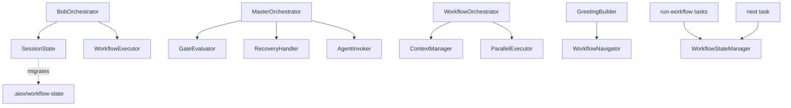

# Orchestration Hierarchy

This document defines the current ownership boundaries for AIOX orchestration
modules and the lifecycle status of legacy workflow scripts.

## Decision Summary

New story and epic lifecycle state must use
`.aiox-core/core/orchestration/session-state.js`.

`.aiox-core/development/scripts/workflow-state-manager.js` is deprecated for new
lifecycle work. It remains available only for legacy guided workflow tasks and
`*next` compatibility until those entry points are migrated.

`.aiox-core/development/scripts/workflow-navigator.js` is not deprecated. It is
an active read-only suggestion helper and must not become the owner of persisted
state.

## Module Boundaries

| Module | Status | Owns | Should Be Used For | Should Not Be Used For |
| --- | --- | --- | --- | --- |
| `BobOrchestrator` | Active | Project-state decision tree for Bob/PM flows | Greenfield and brownfield routing, story-driven development orchestration, observability callbacks | Generic YAML workflow execution or ADE Epic 0 compatibility |
| `MasterOrchestrator` | Active legacy/ADE | Epic 0 autonomous development pipeline | Coordinating ADE epics, gates, recovery, and agent invocation | Bob project-state routing or new Bob session persistence |
| `WorkflowOrchestrator` | Active | Generic YAML workflow execution | Multi-agent workflow phases loaded from workflow YAML | Bob decision-tree routing or story/epic session persistence |
| `SessionState` | Canonical | Persistent epic/story lifecycle state | Crash recovery, Bob progress tracking, story/epic resume state | Stateless command suggestions |
| `WorkflowNavigator` | Active helper | Command suggestions from workflow patterns and context | Greeting-time suggestions, next-step hints, read-only navigation | Persisting or mutating workflow/story state |
| `WorkflowStateManager` | Deprecated compatibility | Legacy guided workflow state files | Existing `run-workflow`, `run-workflow-engine`, and `next` compatibility | New Bob, story, or epic lifecycle state |

## State Ownership

| State Surface | Owner | Path | Notes |
| --- | --- | --- | --- |
| Bob/story/epic session state | `SessionState` | `docs/stories/.session-state.yaml` | Canonical for new persistent lifecycle state |
| Legacy guided workflow state | `WorkflowStateManager` | `.aiox/{instance-id}-state.yaml` | Deprecated compatibility surface |
| Legacy workflow-state directory | `SessionState` migrator | `.aiox/workflow-state/` | Migration input for ADR-011 compatibility |
| Contextual command suggestions | `WorkflowNavigator` | None | Reads patterns/context and returns suggestions only |

## Import Rules

- New orchestration code must import `SessionState` for persistent story or epic
  lifecycle state.
- New code may import `WorkflowNavigator` only for read-only command suggestions.
- New imports of `workflow-state-manager.js` are allowed only when maintaining
  legacy `run-workflow`, `run-workflow-engine`, or `next` compatibility.
- Task files that reference `workflow-state-manager.js` must include a fallback
  note pointing new lifecycle work to `session-state.js`.
- No orchestration module should import deprecated state helpers without a
  compatibility reason documented near the reference.

## Current Relationships

## Migration Guidance

When touching legacy-guided workflow execution, keep changes narrow and preserve
compatibility. Do not rename legacy state files unless the caller has an
explicit migration path.

When building new Bob or story-driven development behavior, skip
`WorkflowStateManager` entirely and store lifecycle information through
`SessionState`.
